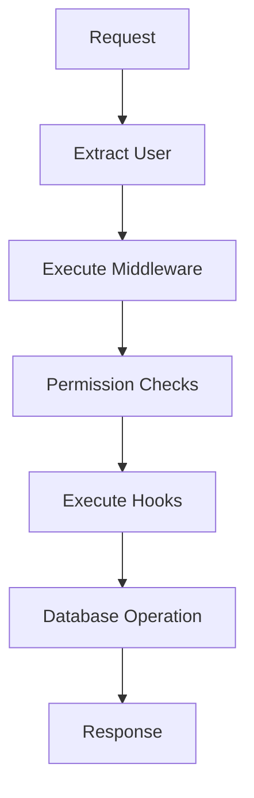

# Middleware

Middleware in better-query allows you to execute custom logic **before permission checks** are performed. This is especially useful for:

- Injecting user information from authentication sessions
- Adding scopes or roles to the request context
- Modifying request data based on external conditions
- Implementing custom security checks
- Logging and auditing access attempts

## Core Concepts

### Execution Order

Understanding the execution order is crucial for effective middleware usage:

1. **Middleware execution** - Modifies context (user, scopes, data)
2. **Permission checks** - Uses enriched context from middleware
3. **Hook execution** - Uses context modified by both middleware and permissions
4. **Database operations** - Final data persistence



### Middleware vs Hooks

| Feature | Middleware | Hooks |
|---------|------------|-------|
| **Execution timing** | Before permissions | After permissions |
| **Can modify user context** | ✅ Yes | ❌ No (too late) |
| **Can modify scopes** | ✅ Yes | ❌ No (too late) |
| **Can modify data** | ✅ Yes | ✅ Yes |
| **Access to existing data** | ✅ Yes (for update/delete) | ✅ Yes |
| **Purpose** | Context enrichment | Data manipulation |

## Basic Usage

### User Injection Middleware

The most common use case is injecting user information from authentication sessions:

```ts title="query.ts"
import { createResource } from "better-query";
import { auth } from "./auth"; // Your auth instance
import { headers } from "next/headers"; // For Next.js

const todoResource = createResource({
  name: "todo",
  schema: todoSchema,
  
  // Middleware runs BEFORE permission checks
  middleware: [
    {
      handler: async (context) => {
        // Get user from authentication session
        const session = await auth.api.getSession({
          headers: await headers()
        });
        
        // Inject user into context
        context.user = session?.user;
        
        // Optionally add scopes/roles
        if (session?.user) {
          context.scopes = session.user.roles || [];
        }
      }
    }
  ],
  
  permissions: {
    create: async (context) => {
      // User is now available thanks to middleware!
      return !!context.user;
    },
    
    update: async (context) => {
      // Check ownership with injected user
      return context.existingData?.userId === context.user?.id;
    }
  }
});
```

### Multiple Middleware Functions

You can chain multiple middleware functions that execute in order:

```ts title="query.ts"
const productResource = createResource({
  name: "product",
  schema: productSchema,
  
  middleware: [
    // 1. Inject user from session
    {
      handler: async (context) => {
        const session = await getSession();
        context.user = session?.user;
      }
    },
    
    // 2. Add organization context
    {
      handler: async (context) => {
        if (context.user?.organizationId) {
          const org = await getOrganization(context.user.organizationId);
          context.organization = org;
          context.scopes = [...(context.scopes || []), ...org.permissions];
        }
      }
    },
    
    // 3. Apply rate limiting per organization
    {
      handler: async (context) => {
        if (context.organization) {
          await checkRateLimit(context.organization.id, context.operation);
        }
      }
    }
  ],
  
  permissions: {
    create: async (context) => {
      // All middleware has run, context is fully enriched
      return context.scopes?.includes("product:create") || false;
    }
  }
});
```

## Advanced Patterns

### Conditional Middleware

Apply middleware only for specific operations:

```ts title="query.ts"
const userResource = createResource({
  name: "user",
  schema: userSchema,
  
  middleware: [
    {
      handler: async (context) => {
        // Only inject admin context for delete operations
        if (context.operation === "delete") {
          const adminSession = await getAdminSession();
          context.adminUser = adminSession?.user;
        }
        
        // Always inject regular user
        const session = await getUserSession();
        context.user = session?.user;
      }
    }
  ],
  
  permissions: {
    delete: async (context) => {
      // Require admin user for deletions
      return !!context.adminUser;
    },
    
    update: async (context) => {
      // Regular user can update their own profile
      return context.existingData?.id === context.user?.id;
    }
  }
});
```

### Error Handling in Middleware

Handle errors gracefully in middleware:

```ts title="query.ts"
const secureResource = createResource({
  name: "secure",
  schema: secureSchema,
  
  middleware: [
    {
      handler: async (context) => {
        try {
          // Attempt to get user from JWT token
          const token = extractTokenFromRequest(context.request);
          const user = await verifyJWT(token);
          context.user = user;
          
        } catch (error) {
          // Don't throw - let permission check handle unauthorized access
          console.warn("Token verification failed:", error.message);
          context.user = null;
        }
      }
    }
  ],
  
  permissions: {
    create: async (context) => {
      if (!context.user) {
        throw new Error("Authentication required");
      }
      return true;
    }
  }
});
```

### Data Modification Middleware

Middleware can also modify request data:

```ts title="query.ts"
const auditedResource = createResource({
  name: "document",
  schema: documentSchema,
  
  middleware: [
    {
      handler: async (context) => {
        // Inject user
        const session = await getSession();
        context.user = session?.user;
        
        // Add audit fields to create/update operations
        if (context.operation === "create" && context.data) {
          context.data.createdBy = context.user?.id;
          context.data.createdAt = new Date();
        }
        
        if (context.operation === "update" && context.data) {
          context.data.updatedBy = context.user?.id;
          context.data.updatedAt = new Date();
        }
      }
    }
  ]
});
```

## Best Practices

### 1. Keep Middleware Focused

Each middleware function should have a single responsibility:

```ts
// ✅ Good - Single responsibility
const userMiddleware = async (context) => {
  const session = await getSession();
  context.user = session?.user;
};

const scopeMiddleware = async (context) => {
  if (context.user) {
    context.scopes = await getUserScopes(context.user.id);
  }
};

// ❌ Avoid - Multiple responsibilities
const combinedMiddleware = async (context) => {
  const session = await getSession();
  context.user = session?.user;
  context.scopes = await getUserScopes(context.user.id);
  context.rateLimitInfo = await checkRateLimit(context.user.id);
  // ... too many things
};
```

### 2. Handle Missing Dependencies

Always check for required dependencies:

```ts
const scopeMiddleware = async (context) => {
  // Check if user was injected by previous middleware
  if (!context.user) {
    console.warn("User middleware must run before scope middleware");
    return;
  }
  
  context.scopes = await getUserScopes(context.user.id);
};
```

### 3. Use TypeScript for Better DX

Define proper types for your middleware context:

```ts
interface CustomMiddlewareContext extends QueryMiddlewareContext {
  organization?: Organization;
  permissions?: string[];
}

const organizationMiddleware = async (context: CustomMiddlewareContext) => {
  if (context.user?.organizationId) {
    context.organization = await getOrganization(context.user.organizationId);
    context.permissions = context.organization.permissions;
  }
};
```

### 4. Avoid Expensive Operations

Keep middleware fast to avoid request delays:

```ts
// ✅ Good - Cache expensive lookups
const cachedUserMiddleware = async (context) => {
  const session = await getSession();
  if (session?.user) {
    // Use cached user data when possible
    context.user = await getUserFromCache(session.user.id) || 
                   await getUserFromDB(session.user.id);
  }
};

// ❌ Avoid - Expensive operations in every request
const expensiveMiddleware = async (context) => {
  // This runs on every request!
  const allUsers = await db.users.findMany();
  const userPermissions = await calculateComplexPermissions(allUsers);
  // ...
};
```

## Error Handling

Middleware errors are automatically caught and return a 500 response:

```ts
const middleware = [
  {
    handler: async (context) => {
      throw new Error("Something went wrong");
      // This will return: 
      // { error: "Middleware execution failed", details: "Something went wrong" }
      // Status: 500
    }
  }
];
```

For graceful error handling, catch errors within middleware:

```ts
const gracefulMiddleware = {
  handler: async (context) => {
    try {
      context.user = await getUser();
    } catch (error) {
      // Log error but don't fail the request
      console.error("Failed to get user:", error);
      context.user = null;
    }
  }
};
```

## Migration from Hooks

If you're currently using `beforeCreate` hooks for user injection, migrate to middleware:

```ts
// ❌ Before - User injection in beforeCreate (too late for permissions)
const oldResource = createResource({
  name: "todo",
  schema: todoSchema,
  
  permissions: {
    create: async (context) => {
      // context.user is null here! 😞
      return !!context.user;
    }
  },
  
  hooks: {
    beforeCreate: async (context) => {
      // User injection happens AFTER permission check
      const session = await getSession();
      context.user = session?.user;
    }
  }
});

// ✅ After - User injection in middleware (perfect timing)
const newResource = createResource({
  name: "todo",
  schema: todoSchema,
  
  middleware: [
    {
      handler: async (context) => {
        // User injection happens BEFORE permission check
        const session = await getSession();
        context.user = session?.user;
      }
    }
  ],
  
  permissions: {
    create: async (context) => {
      // context.user is available! 🎉
      return !!context.user;
    }
  },
  
  hooks: {
    beforeCreate: async (context) => {
      // Use hooks for data manipulation
      context.data.createdAt = new Date();
    }
  }
});
```

## Related Concepts

- [Hooks](/docs/concepts/hooks) - Data manipulation after permission checks
- [Permissions](/docs/concepts/resources#permissions) - Access control using enriched context  
- [Authentication Integration](/docs/plugins/better-auth) - Official auth plugin
- [Custom Security](/docs/guides/security) - Advanced security patterns